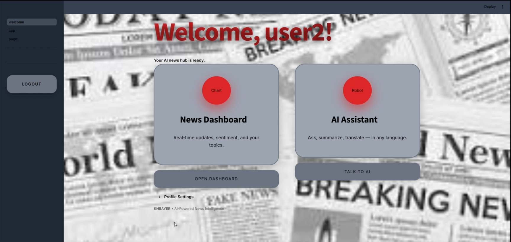
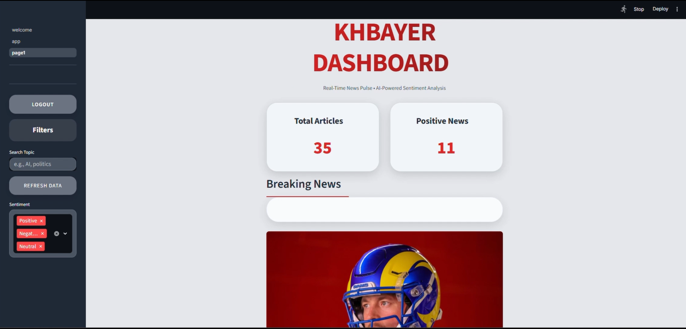
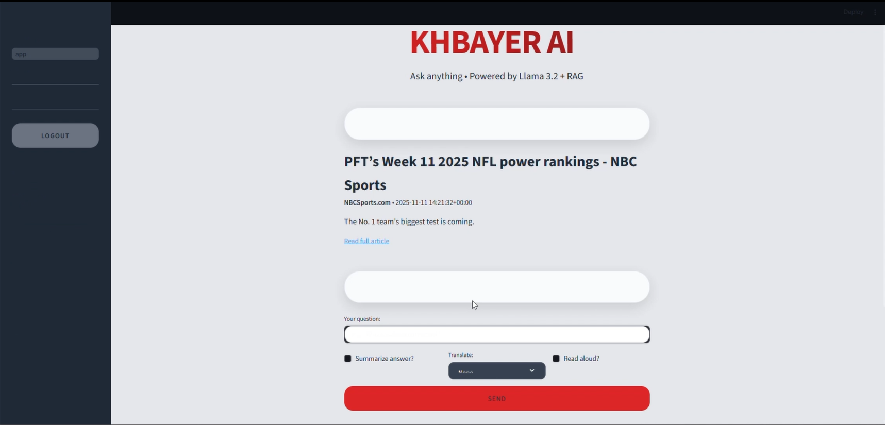
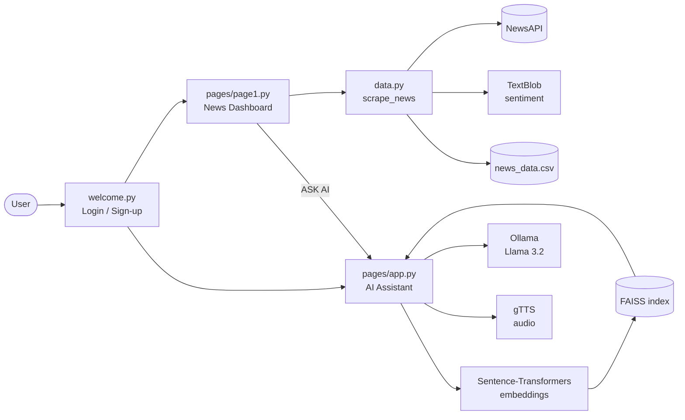

<p align="center">
  
</p>

<h1 align="center">KHBAYER</h1>

<p align="center">
  <b>An AI-powered news platform: real-time headlines, sentiment analysis, and a multilingual RAG assistant that runs locally.</b>
</p>

<p align="center">
  
  
  
  
  
</p>

---

## Overview

**KHBAYER** (Tunisian Arabic for *"the news"*) is a Streamlit web app that brings together:

- a **live news dashboard** built on NewsAPI, with sentiment scores for every article,
- a **Retrieval-Augmented Generation (RAG) assistant** that answers questions from a news knowledge base, using **FAISS** and **multilingual sentence embeddings**,
- a **local LLM** (Llama 3.2 served by **Ollama**) for answering, summarizing and translating,
- **text-to-speech**, so answers can be read aloud in English, French or Arabic.

Users create an account, choose the topics they care about, and get a personalized news feed. From any article they can click **ASK AI** and chat about it.

## Screenshots

| Login | Home |
|---|---|
|  |  |

| News dashboard | AI assistant |
|---|---|
|  |  |

## Features

### Accounts and personalization
- Sign up and log in, with SHA-256 hashed passwords
- Choose your topics (Technology, Politics, Business, Sports, Health, Science, AI & Robotics, Finance and more), theme and language
- One-click **Demo Login** (`admin` / `admin123`)

### News dashboard
- Live headlines from **NewsAPI**: `top-headlines` first, with `/everything` as a fallback
- **Sentiment analysis** with TextBlob, labeling each article *Positive*, *Negative* or *Neutral*
- Duplicate detection on title and URL, both within a fetch and across saved history
- Filters by keyword, sentiment and your preferred topics
- Checks that article links and images are live before showing them
- **Breaking alerts** in the sidebar: every 60 seconds, new articles that match your topics are shown
- Results cached for 5 minutes with `st.cache_data`

### AI assistant (RAG)
- **Article mode**: ask questions about the article you selected on the dashboard
- **Free chat mode**: the question is embedded with `paraphrase-multilingual-MiniLM-L12-v2`, the top 5 matching articles are retrieved from a **FAISS** index, and Llama 3.2 answers using only that context
- Optional post-processing:
  - **Summarize** the answer into 3 bullet points
  - **Translate** the answer to French or Arabic
  - **Read aloud** with gTTS

## Architecture



### Data and model pipeline (`news_notebook.ipynb`)
1. **Cleaning**: load the raw news dataset, keep the useful columns, drop empty, missing and duplicate rows, and strip HTML and special characters. The result is `dataset_cleaned2.csv`.
2. **Topic classification**: zero-shot classification into *politics, sports, economy, technology, health, entertainment*.
3. **Exploration**: Plotly charts of the topic distribution and of articles over time (2022–2025).
4. **Embeddings**: `title | content | topic` is encoded with `paraphrase-multilingual-MiniLM-L12-v2`, and the embedding space is visualized with PCA.
5. **Indexing**: the embeddings are saved as `article_embeddings.npy` and `faiss_index.idx`.
6. **Evaluation**: RAG answers are scored against reference answers with semantic (cosine) similarity. Well-covered topics such as sports reached **~0.85**.

## Project structure

```
.
├── welcome.py              # Entry point: login, sign-up, home
├── data.py                 # NewsAPI fetching, sentiment, deduplication
├── pages/
│   ├── page1.py            # News dashboard
│   ├── app.py              # RAG AI assistant (Ollama + FAISS + gTTS)
│   ├── article_embeddings.npy
│   └── faiss_index.idx
├── news_notebook.ipynb     # Cleaning, classification, embeddings, evaluation
├── dataset_cleaned2.csv    # Cleaned news dataset
├── téléchargement.jpg      # App background
├── docs/                   # Logo and screenshots
├── requirements.txt
└── .env.example
```

## Getting started

### Prerequisites
- Python 3.10+
- [Ollama](https://ollama.com) installed and running
- A free [NewsAPI](https://newsapi.org) key

### 1. Clone and install
```bash
git clone https://github.com/<your-username>/khbayer.git
cd khbayer
python -m venv .venv
# Windows
.venv\Scripts\activate
# macOS / Linux
source .venv/bin/activate

pip install -r requirements.txt
python -m textblob.download_corpora
```

### 2. Pull the language model
```bash
ollama pull llama3.2
```

### 3. Set environment variables
```powershell
# Windows PowerShell
$env:NEWSAPI_KEY = "your_newsapi_key"
```
```bash
# macOS / Linux
export NEWSAPI_KEY="your_newsapi_key"
```

The assistant reads its knowledge base from `dataset_with_category.csv` (`;`-separated, with a `content` column), which `news_notebook.ipynb` produces. Put it in the project root, or point `KHBAYER_DATASET` to it.

### 4. Run
```bash
streamlit run welcome.py
```
Open http://localhost:8501 and sign up, or use **Demo Login**.

## Tech stack

| Layer | Tools |
|---|---|
| UI | Streamlit, custom CSS, streamlit-lottie, Plotly |
| News data | NewsAPI, requests, pandas |
| NLP | TextBlob (sentiment), zero-shot topic classification |
| Retrieval | sentence-transformers, FAISS |
| Generation | Llama 3.2 via Ollama |
| Speech | gTTS |

## Roadmap
- Replace the JSON user store with a database and salted password hashing
- Stream LLM responses token by token
- Rebuild the FAISS index automatically as new articles arrive
- Deploy with Docker

## Author

**Nour El Houda Najjar**, ESPRIT
